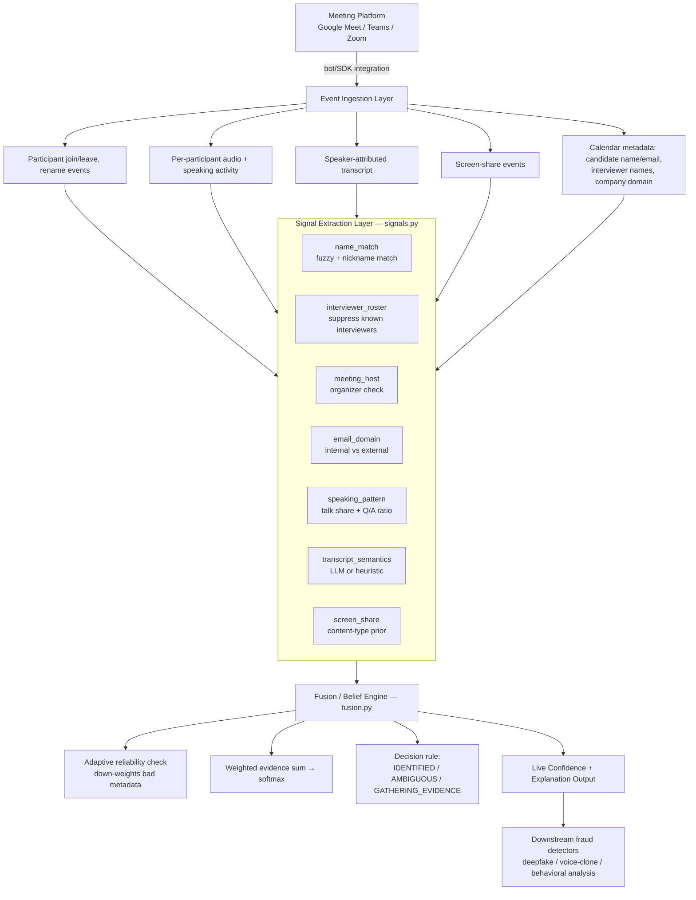

# Architecture

## Why this shape

**Signals are independent and additive.** Each signal function only needs to
know about the participant it's scoring plus the shared calendar metadata --
it never talks to other signals. That means adding, removing, or reweighting
a signal is a one-line change in `fusion.py`, and a bad/failing signal (e.g.
an LLM API outage) degrades gracefully instead of breaking the pipeline.

**Fusion is transparent by construction.** Using a weighted linear combination
+ softmax (instead of, say, a black-box neural classifier) means every
probability the system reports comes with a full, human-readable trace of
which evidence produced it. That directly serves the challenge's
explainability requirement, and it's the same design pattern production
fraud/trust systems use precisely because auditability matters as much as
accuracy.

**The engine treats external metadata as evidence, not ground truth.** The
calendar invite is just another (fallible) input. The adaptive reliability
check explicitly detects when that input looks wrong (no participant matches
the given candidate name) and compensates by leaning harder on behavioral and
transcript evidence -- rather than either blindly trusting a wrong name or
crashing/refusing to proceed.

**Decisions default to uncertainty, not force.** `fusion.evaluate()` has three
outcomes, not two -- `AMBIGUOUS` and `GATHERING_EVIDENCE` are first-class
results, not error states. A system that must always output "the candidate is
X" will eventually output a confidently wrong answer; a system that can say
"not sure yet" is safer for a fraud-detection product where the downstream
consequence of misidentifying the candidate is analyzing the wrong person's
video for deepfakes.

## Component responsibilities

| Component | Responsibility | Real-world equivalent |
|---|---|---|
| Event Ingestion | Normalize platform-specific events into one schema | Recall.ai / native Meet-Teams-Zoom SDKs |
| Signal Extraction | Turn raw evidence into bounded, explainable scores | Independent scoring microservices/functions |
| Fusion/Belief Engine | Combine signals, track reliability, decide | Central reasoning service, re-run per event or on a timer |
| Output | Confidence + reasoning trace | Dashboard API consumed by ops UI and by the fraud detectors themselves |
